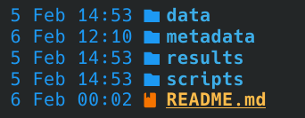

# Introducción a la programación para bioinformática con Bash

## Aprendiendo a usar Git
- **Nombre del estudiante**: David Cruz P.
- **Nombre del curso**: Introducción a la Programación para Bioinformática con Bash
- **Descripción general del repositorio**: Este repositorio será usado para entrega de tareas en el curso

*Tillandsia fasciculata*

## 1. Se incluyó la tarea de la Unidad 2
Se modificó la estructura de directorios para seguir la estructura indicada

*Estructura de directorios*

    

